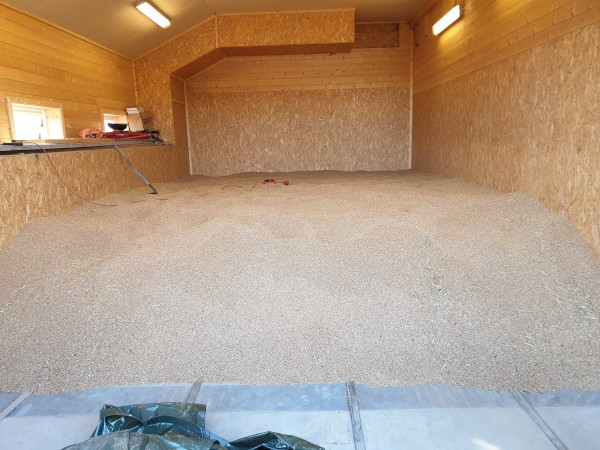
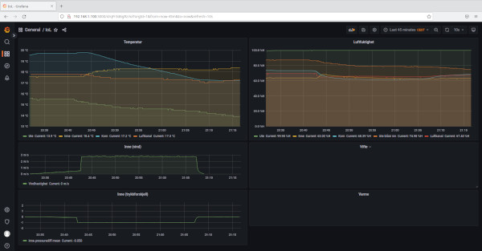
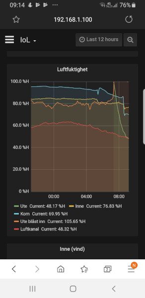

# IoL
Internet Of Låve (english: Internet Of Barn, a play on the term Internet Of Things) is a system I've made for a colleague at Computas that also happens to have a farm.  
The systems consists of a Raspberry Pi server, a WiFi access point for local WiFi and a set of ESP8266 with custom shield reporting sensor values using MQTT over WiFi.  

The custom shield is used for these tasks:
* Outdoor temperature and humidity
* Indoor temperature and humidity
* Air duct temperature, humidity, air speed and air pressure
* Two temperature and humidity sensors to put into the grain

The goal of this project is to calculate when outside air blown indoors is drier than the air that is already indoor, and thus starting a fan running on cheap electricity would be enough to dry the grain instead of having the air dryer running on expensive diesel.

### pictures

Here is a picture of the barn full of grain. The air duct comes down from the ceiling and under the left side window. There are air vents crossing the room running from the left side air duct.  
  

All sensor values are sent by MQTT to Mosquitto running on the Raspberry Pi. A local installation of Node-Red captures the values, massages them, and stores them in InfluxDB. A Grafana dashboard fetches data from InfluxDB and makes informative graphs. In the screenshot below you can see the period where the fan was manually turned on (thus creating wind speed and pressure difference in the air duct). This was immediately after the grain was harvested, so the results are admittedly better than usual, but you can see that the temperature and humidity in the grain will trend towards that in the air duct. As the outside humidity adjusted for indoor temperature is higher than the indoor humidity at the time of the screenshot, running the fan does not result in dryer grain and was only done for demonstration purposes.  

The barn does not have an internet connection, but the WiFi access point exposes Grafana running on the Raspberry Pi, and accessing it from a phone connected to the same WiFi network works like a charm.  
